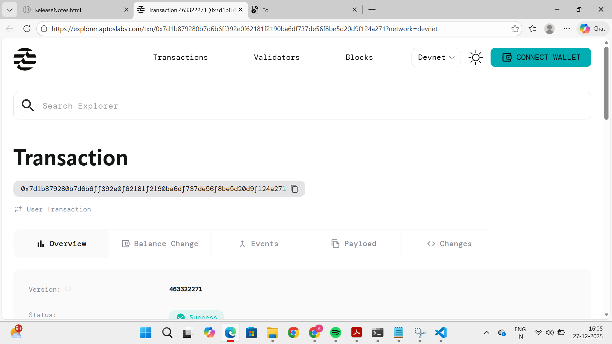

# Energy Trade Decentralizer ⚡

A decentralized peer-to-peer (P2P) energy trading platform built on the **Aptos Blockchain**. This project allows prosumers (producers) to sell excess renewable energy directly to consumers using smart contracts.

## 🚀 Overview
The Energy Trade Decentralizer eliminates the need for a central utility intermediary, allowing for:
* **Direct P2P Trading:** Sellers list energy; buyers purchase at market or fixed rates.
* **Transparency:** All trades are recorded on the Aptos ledger.
* **Security:** Smart contracts handle the escrow and transfer of energy credits/tokens.

## 🛠 Tech Stack
* **Language:** Move (Aptos)
* **CLI:** Aptos CLI
* **Blockchain:** Aptos (Devnet/Testnet)

## 📁 Project Structure
* `sources/`: Contains the Move smart contracts (e.g., `EnergyMarket.move`).
* `Move.toml`: Project configuration and dependencies.
* `tests/`: Unit tests for trading logic.

## ⚙️ Setup & Installation

### Prerequisites
1.  Install [Aptos CLI](https://aptos.dev/tools/aptos-cli/install-cli/).
2.  Initialize your Aptos profile:
    ```bash
    aptos init
    ```

### Build the Project
```bash